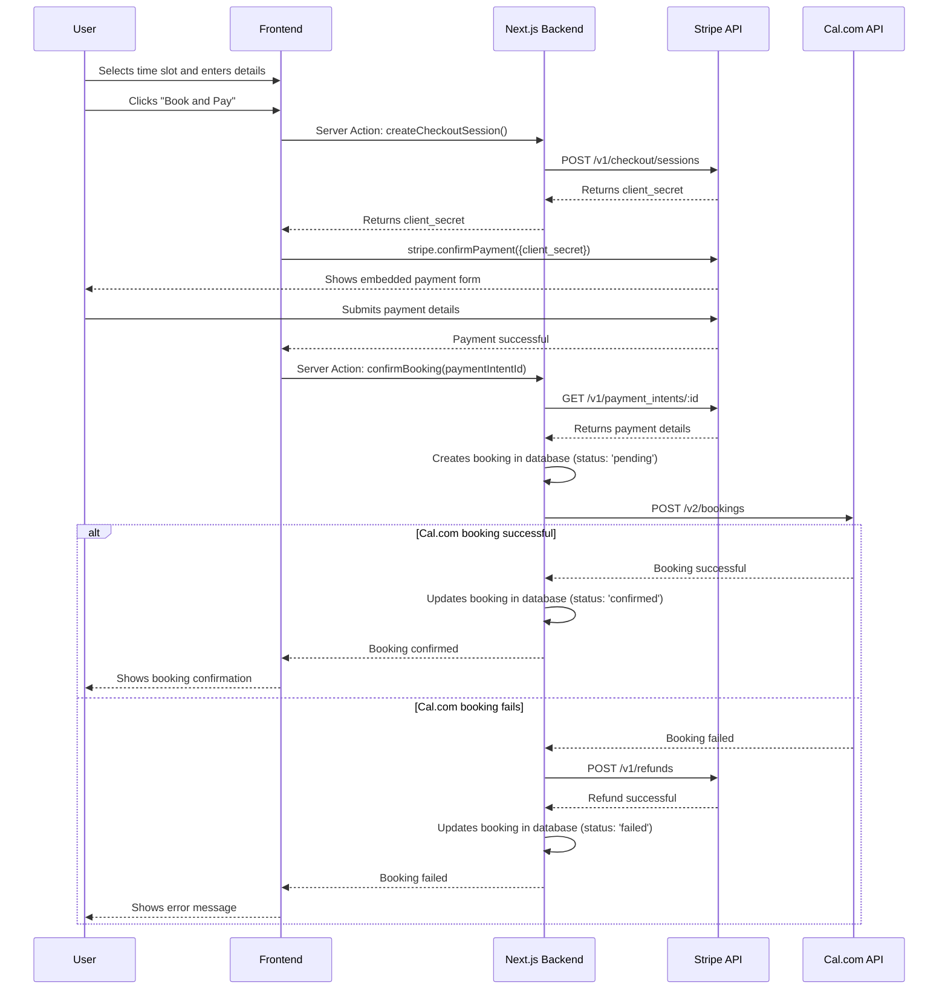

# Stripe Booking Integration Architecture

This document outlines the technical architecture for integrating Stripe Checkout into the mentor booking flow.

## 1. End-to-End User Flow

The following steps describe the user's journey from selecting a time slot to receiving a final booking confirmation.

1.  **Selects Time Slot**: The user selects a time slot from the mentor's booking page.
2.  **Enters Details**: The user enters their name and email address.
3.  **Initiates Payment**: The user clicks "Book and Pay".
4.  **Stripe Checkout**: The user is presented with an embedded Stripe Checkout form.
5.  **Completes Payment**: The user enters their payment details and completes the payment.
6.  **Payment Confirmation**: The frontend receives a confirmation from Stripe that the payment was successful.
7.  **Booking Creation**: The frontend calls a server action to create the booking in the local database and with the external Cal.com API.
8.  **Booking Confirmation**: The user sees a confirmation message indicating that their booking is complete.
9.  **Email Confirmation**: The user receives an email confirmation with the booking details.

## 2. Sequence Diagram



## 3. API Endpoint Definitions

### Server Actions

#### `createCheckoutSession(eventTypeId: number): Promise<{ client_secret: string }>`

- **Purpose**: Creates a Stripe Checkout Session and returns the `client_secret` to the frontend.
- **Authentication**: User must be authenticated.
- **Request Body**:
  - `eventTypeId` (number): The ID of the event type being booked.
- **Response Body**:
  - `client_secret` (string): The client secret for the Stripe Checkout Session.

#### `confirmBooking(paymentIntentId: string): Promise<{ success: boolean, bookingId?: string, error?: string }>`

- **Purpose**: Confirms the booking after a successful payment. It creates a booking in the local database, calls the Cal.com API to create the booking, and handles any errors that may occur.
- **Authentication**: User must be authenticated.
- **Request Body**:
  - `paymentIntentId` (string): The ID of the Stripe Payment Intent.
- **Response Body**:
  - `success` (boolean): Indicates whether the booking was successful.
  - `bookingId` (string, optional): The ID of the created booking.
  - `error` (string, optional): An error message if the booking failed.

### API Routes

#### `POST /api/webhooks/stripe`

- **Purpose**: Handles incoming webhooks from Stripe. This will be used to listen for payment-related events, such as `payment_intent.succeeded`, and to update the booking status accordingly.
- **Authentication**: None (verified by Stripe signature).

## 4. Database Schema Modifications

### New Table: `payments`

A new table, `payments`, will be created to store information about each transaction.

```sql
CREATE TABLE discuno_payment (
    id SERIAL PRIMARY KEY,
    booking_id INTEGER NOT NULL REFERENCES discuno_booking(id),
    stripe_payment_intent_id VARCHAR(255) NOT NULL UNIQUE,
    amount INTEGER NOT NULL,
    currency VARCHAR(3) NOT NULL,
    status VARCHAR(50) NOT NULL, -- e.g., 'succeeded', 'pending', 'failed'
    created_at TIMESTAMP WITH TIME ZONE DEFAULT CURRENT_TIMESTAMP,
    updated_at TIMESTAMP WITH TIME ZONE DEFAULT CURRENT_TIMESTAMP
);
```

### Modifications to `bookings` Table

The `bookings` table will be modified to include a new status and a foreign key to the `payments` table.

- **New `booking_status` enum value**: A new status, `AWAITING_PAYMENT`, will be added to the `booking_status` enum.
- **New `paymentId` column**: A new nullable `paymentId` column will be added to the `bookings` table to link to the `payments` table.

The `bookingStatusEnum` will be updated as follows:

```typescript
export const bookingStatusEnum = pgEnum('booking_status', [
  'AWAITING_PAYMENT', // New status
  'ACCEPTED',
  'PENDING',
  'CANCELLED',
  'REJECTED',
] as const)
```

The `bookings` table will be updated to include the `paymentId` column:

```typescript
export const bookings = pgTable('discuno_booking', {
  // ... existing columns
  paymentId: integer().references(() => payments.id, { onDelete: 'set null' }),
})
```

## 5. Frontend Component Architecture

### Modified Components

- **`BookingEmbed.tsx`**: This component will be modified to include the Stripe Checkout flow.
  - It will call the `createCheckoutSession` server action to get a `client_secret` from Stripe.
  - It will use the `@stripe/react-stripe-js` library to render the embedded checkout form.
  - After a successful payment, it will call the `confirmBooking` server action to finalize the booking.

### New Components

- **`StripeCheckoutForm.tsx`**: A new component that wraps the Stripe `EmbeddedCheckout` component.
  - It will be responsible for initializing Stripe.js and handling the checkout process.
  - It will be used within the `BookingEmbed` component.

## 6. Manual Payout Strategy

To hold funds for 72 hours before paying the mentor, we will use Stripe's manual payout capabilities.

1.  **Fund Holding**: When a payment is successfully captured, the funds will be held in the platform's Stripe account.
2.  **Payout Schedule**: A cron job will run every hour to check for payments that are eligible for payout.
3.  **Eligibility Check**: The cron job will query the `payments` table for transactions that have a `status` of `succeeded` and are older than 72 hours.
4.  **Payout Initiation**: For each eligible payment, the cron job will initiate a manual payout to the mentor's connected Stripe account.
5.  **Payout Confirmation**: The cron job will update the payment status in the `payments` table to `paid` after the payout is successfully initiated.

### Cron Job Implementation

A new API route, `POST /api/cron/process-payouts`, will be created to house the logic for the cron job. This route will be secured to prevent unauthorized access.

## 7. Error Handling and Edge Cases

- **Payment Failure**: If the payment fails, the user will be shown an error message and prompted to try again.
- **Cal.com API Failure**: If the Cal.com API fails after a successful payment, the `confirmBooking` server action will automatically refund the payment and show an error message to the user.
- **Race Conditions**: To prevent race conditions, the `confirmBooking` server action will be idempotent. If the action is called multiple times for the same payment intent, it will not create duplicate bookings.
- **Webhook Failures**: If the Stripe webhook fails, it will be retried automatically by Stripe. The webhook handler will be designed to handle duplicate events.
