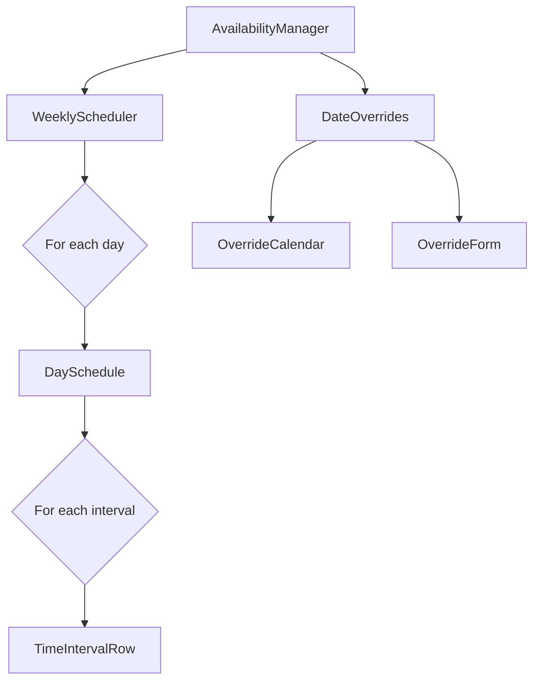

# Availability Component Architecture

This document outlines the architecture for the Cal.com-inspired availability component.

## 1. Data Model

The data model will represent the mentor's availability, including weekly schedules and date-specific overrides.

```typescript
// In a new file: apps/web/src/app/types/availability.ts

export interface TimeInterval {
  start: string // "HH:mm" format (e.g., "09:00")
  end: string // "HH:mm" format (e.g., "17:00")
}

export interface WeeklySchedule {
  [day: string]: TimeInterval[] // day: "sunday", "monday", ...
}

export interface DateOverride {
  date: string // "YYYY-MM-DD" format
  intervals: TimeInterval[]
}

export interface Availability {
  id: string // Corresponds to Cal.com schedule ID
  userId: string
  weeklySchedule: WeeklySchedule
  dateOverrides: DateOverride[]
}
```

## 2. API Layer (Server Actions)

The following server actions will be added to `apps/web/src/app/(default)/(dashboard)/scheduling/actions.ts` to interact with the Cal.com API.

```typescript
// In apps/web/src/app/(default)/(dashboard)/scheduling/actions.ts

/**
 * Fetches the user's availability schedule from Cal.com.
 */
export async function getAvailability(): Promise<Availability | null> {
  // ... implementation using Cal.com API to get a schedule
}

/**
 * Creates a new availability schedule for the user in Cal.com.
 */
export async function createAvailability(
  schedule: Omit<Availability, 'id'>
): Promise<Availability> {
  // ... implementation using Cal.com API to create a schedule
}

/**
 * Updates an existing availability schedule in Cal.com.
 */
export async function updateAvailability(schedule: Availability): Promise<Availability> {
  // ... implementation using Cal.com API to update a schedule
}
```

## 3. Component Structure

The UI will be broken down into a hierarchy of React components.

- **`AvailabilityManager` (Container)**

  - **Purpose:** Main container for the availability settings. Fetches and manages the availability state.
  - **Props:** None
  - **State:** `availability: Availability | null`

- **`WeeklyScheduler`**

  - **Purpose:** Displays and allows editing of the 7-day weekly schedule.
  - **Props:**
    - `schedule: WeeklySchedule`
    - `onScheduleChange: (newSchedule: WeeklySchedule) => void`

- **`DaySchedule`**

  - **Purpose:** Represents a single day in the weekly schedule.
  - **Props:**
    - `day: string`
    - `intervals: TimeInterval[]`
    - `onIntervalsChange: (newIntervals: TimeInterval[]) => void`

- **`TimeIntervalRow`**

  - **Purpose:** A single row for a start/end time interval.
  - **Props:**
    - `interval: TimeInterval`
    - `onIntervalChange: (newInterval: TimeInterval) => void`
    - `onRemove: () => void`

- **`DateOverrides`**

  - **Purpose:** Manages date-specific overrides.
  - **Props:**
    - `overrides: DateOverride[]`
    - `onOverridesChange: (newOverrides: DateOverride[]) => void`

- **`OverrideCalendar`**

  - **Purpose:** A calendar view to select dates for overrides.
  - **Props:**
    - `onDateSelect: (date: string) => void`
    - `highlightedDates: string[]`

- **`OverrideForm`**
  - **Purpose:** A form to edit the time intervals for a specific override date.
  - **Props:**
    - `override: DateOverride`
    - `onOverrideChange: (newOverride: DateOverride) => void`

Here is a diagram of the component hierarchy:



## 4. File Structure

The new files will be organized within the `scheduling` directory.

```
apps/web/src/app/(default)/(dashboard)/scheduling/
├── availability-architecture.md  // This file
├── components/
│   ├── availability/
│   │   ├── AvailabilityManager.tsx
│   │   ├── DateOverrides.tsx
│   │   ├── DaySchedule.tsx
│   │   ├── OverrideCalendar.tsx
│   │   ├── OverrideForm.tsx
│   │   ├── TimeIntervalRow.tsx
│   │   └── WeeklyScheduler.tsx
│   ├── EventTypeListClient.tsx
│   ├── EventTypeToggleSection.tsx
│   ├── SchedulingContent.tsx
│   └── SchedulingShell.tsx
├── actions.ts
└── page.tsx
```

## 5. Integration

The `AvailabilityManager` component will be added to the `SchedulingContent` component, which is rendered by the `SchedulingPage`.
